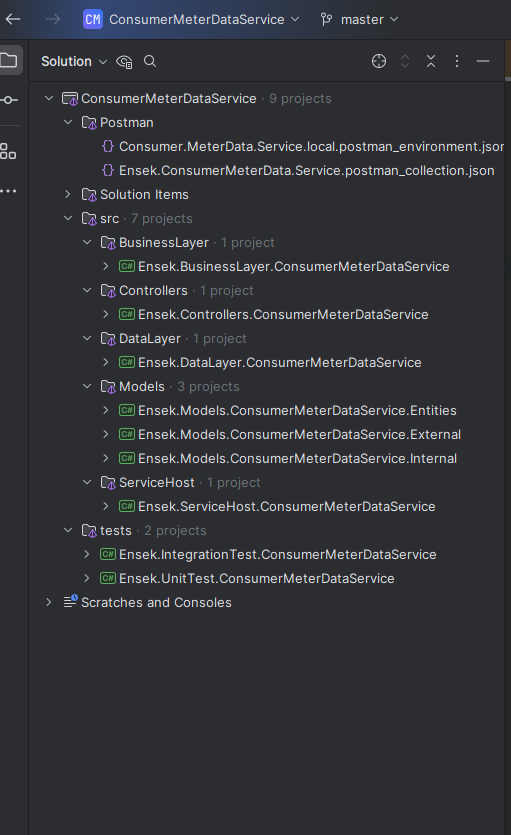

Current Structure of the project

The Posman collection for testing

## Things To Note

* The solution structure does not reflect on the physical folder structure, hence screenshot attached to reflect ideal structure I would like to have in physical folder/file structure or depend on what company follows.

* With the time constrain I wasn't able to get the EF CORE for SQLLite up and running, and keep complaining for some reason therefore couldn't get db up and running for the solution.
* Given more time I would like to add more unit tests for all the classes at least to 80% code coverage in solution, however, I was ONLY managed to add little unit test.
* I would like to add `MeterReadingManage` as a dependency to the `MeterReadingController` instead `FileProcessor` as a part of **Separation of Concerns** would like to explain why I like to take that approach.
* The `MeterReadingResponse` I would like to use as a Builder pattern than using `new` as object was build as we go along.
* Any `new Guid()` or `DateTime` I would consider using Adaptor pattern as this will help to stay away from hard initalization and help on more controlled unit testing.
* I would use `AutoMapper` or similar for mapping external service models (request/response) to internal and any internal to entity models vice versa where appropriate.
* I would break down `foreach (var meterReading in meterReadings)` logic into more logically structured `private methods`.
* I will add Integration test with **Cucumber** test for **Behavior Driven** testing.
* I will update Postman collection with other positive and negative scenarios.

## Future Enhancements

* Suppose `MeterReadings.cvs` contains millions of records, then I would consider using PLINQ or Batch processing method and off load that processor to dedicated microservice to enhance performance.
* Consider using high performance types as `Span<T>`, `ReadOnlySpan<T>` and `Memory<T>` where appropriate.  